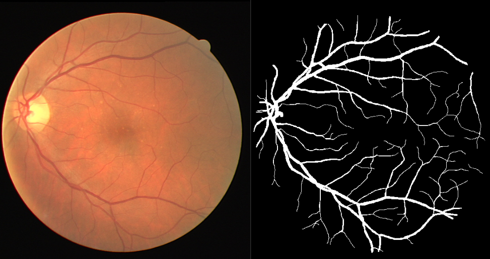

# The UNET

## Dataset
### DRIVE 2004
The DRIVE database was established to enable comparative studies on segmentation of blood vessels in retinal images. The dataset is available on [kaggle](https://www.kaggle.com/datasets/zionfuo/drive2004). Sample image and mask are shown below.

## UNET from scratch

With reference to the original UNET paper, I build the UNET architecture from scratch with PyTorch. The architecture is shown below.

I train and evaluate the model on the DRIVE 2004 dataset and visualize its predictions (masks). I experiment with different batch sizes and epochs.  

## Using a pretrained encoder

Using the segmentation_models.pytorch [library](https://github.com/qubvel/segmentation_models.pytorch/tree/master), I train a UNET with a pretrained encoder (resnet) on the same DRIVE 2004 dataset.

## Results
As expected, the UNET model with the pretrained encoder performs significantly better than the base UNET model. This is evident in the training logs and metrics shown below. Furthermore, the models are used to perform inference on some unseen test data and their predictions (masks) are visualized. The 'ResUNET' performes much better than the base UNET.

## TODO
- [ ] Add testing loop
- [ ] Add command line arguments
- [ ] Build model from scratch with only paper and no other resources
- [ ] Experiment with other UNET varients